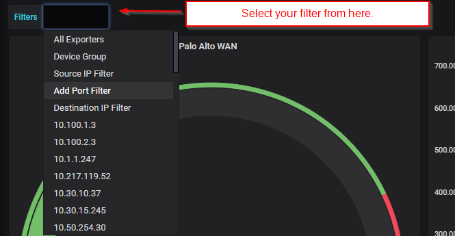
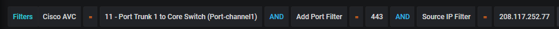
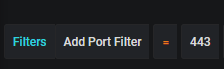

.. _adhocFilters:

Applying Filters
===================

From the dropdown box you can start to build your filters. 

You can add any combinations of filters you like. 

If you do not add a exporter filter, the Grafana will preserve whatever export was chosen when you built the gadget originally. 

