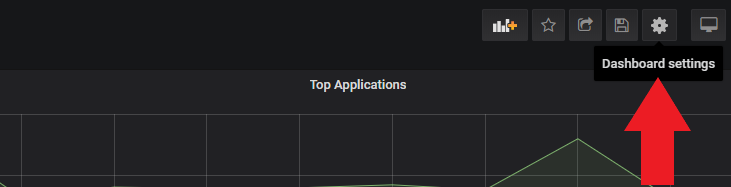
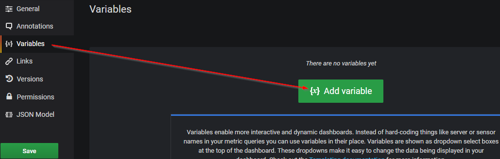
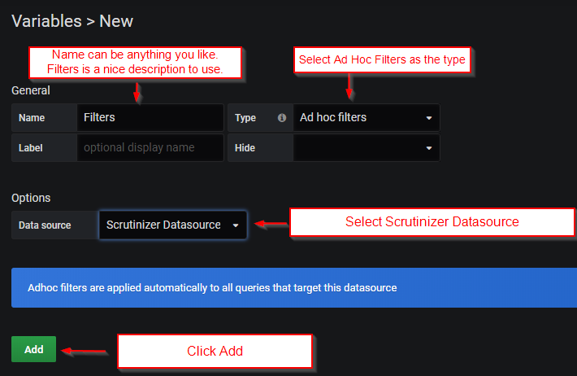
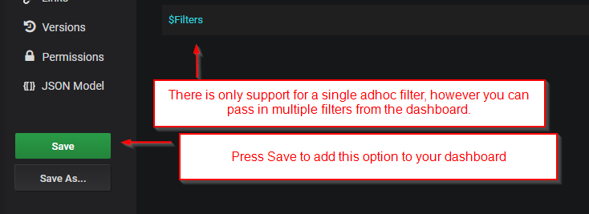

.. _adhocFilters:

Adhoc Filter Setup
===================

Adhoc filters allow the user to filter a variety of reports from a single dashboard view within Grafana. 

These filters are first configured under the settings section of any dashboard. 

Navigate to the Variables Section. 

Example Configuration 

Once you have configured hit add, make sure you save the filters to the dashboard. 

