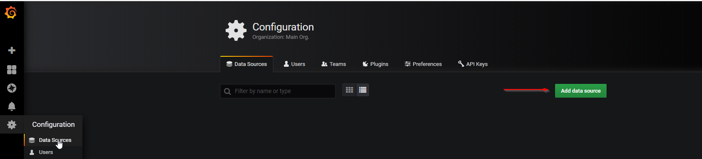

Adding Datasource to Grafana
============================

Within the Grafana user interface navigate to settings and select 'Data Sources' under the configuration section. 

Select the Plixer Scrutinizer Datasource

