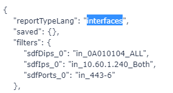
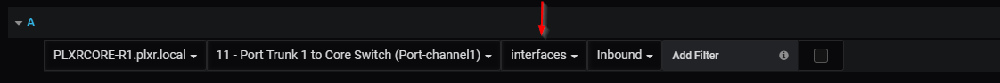

.. _specifyReport:

Specifying a Report
==========================

The Select Report drop down comes with a few reccomended reports. If you are familiar with Scrutinizer you know that there are hundreds of different reports that are available to choose from. 

Instead of populating all of those reports in the dropdown, you have the ability to put any report name you like in the box. To find out the report names it's easiest to run the report in scrutinizer and look at the report JSON to figure out the name. Once you have it copy it, paste it in the box and press enter. 

